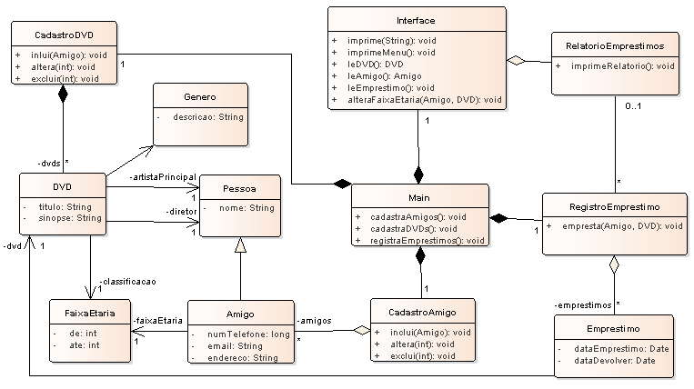

# Implementação do Controle de Empréstimos de de DVD em Java v1.

## Contextualização
Seu primo possui muitos DVDs, todos originais, e vive emprestando aos amigos dele. Entretanto, muitas vezes ele esquece a quem emprestou e já perdeu diversos DVDs por causa disso.

No almoço da família, no último final de semana, ele pediu para você desenvolver um programa para resolver este problema.

Esse sistema deve permitir o cadastro dos amigos, incluindo: nome, número do telefone e e-mail e também cadastrar os DVDs, com: título, sinopse, diretor, ator principal, gênero (comédia, romance ou aventura, etc) e faixa etária. Deve ser possível registrar os empréstimos e obter a lista de DVDs emprestados incluindo quais amigos estão com quais DVDs.

## Diagrama de classe

